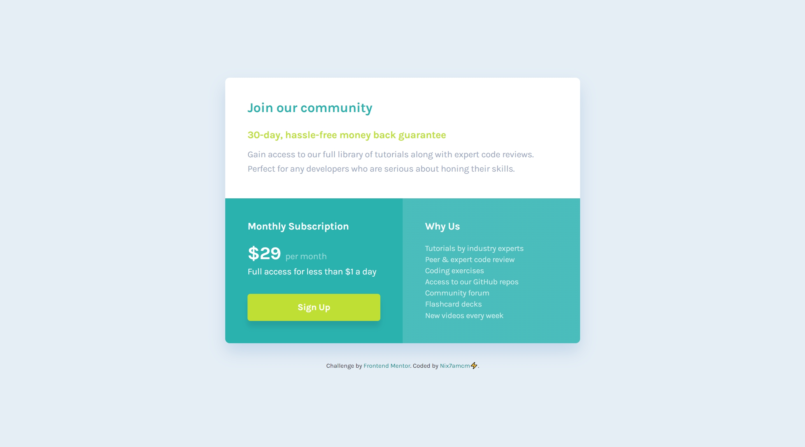

# Frontend Mentor - Single price grid component solution

This is my solution to the [Single price grid component challenge on Frontend Mentor](https://www.frontendmentor.io/challenges/single-price-grid-component-5ce41129d0ff452fec5abbbc).

## Table of contents

- [Overview](#overview)
  - [Challenge Requirements](#challenge-requirements)
- [Screenshots](#screenshots)
- [Links](#links)
- [My process](#my-process)
  - [Built with](#built-with)
- [Author](#author)

---

## Overview

👩🏻‍💻 [Frontend Mentor](www.frontendmentor.io) challenges help you improve your coding skills by building realistic projects.

⚡ This challenge was to build a responsive single price grid component.

🚀 I built this using HTML and CSS, with the help of [Figma](https://www.figma.com) for the design.

### Challenge Requirements

Users should be able to:

- View the optimal layout for the component depending on their device's screen size
- See a hover state on desktop for the Sign Up call-to-action

---

## Screenshots

---

## Links

- Solution URL: [frontendmentor.io/solutions/single-price-grid-component-B1JRVfSjH8](https://www.frontendmentor.io/solutions/single-price-grid-component-B1JRVfSjH8)
- Live Site URL: [nix7amcm.github.io/FEM-single-price-grid-component/](https://nix7amcm.github.io/FEM-single-price-grid-component/)

---

## My process

### Built with

- Semantic HTML5 markup
- CSS custom properties
- Flexbox
- CSS Grid
- Figma

---

## Author

- Website - [Nix7amcm](https://github.com/Nix7amcm)
- Frontend Mentor - [@Nix7amcm](https://www.frontendmentor.io/profile/Nix7amcm)
- LinkedIn - [amcm-8807](https://www.linkedin.com/in/amcm-8807/)

---
---